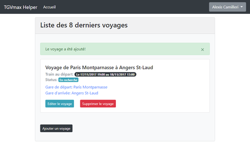

# TGVmax Helper

**ℹ This project is a fork of [the one from krysenn](https://github.com/krysennn/tgvmaxhelper).
Since the main project has been cut, this one is just a backup of the latest version available.**

> [en] Book TGVmax tickets automatically

> [fr] Permet de réserver ses billets TGVmax automatiquement.

I bought TGVmax card and i'm bored to searching some trip every time on voyages-sncf or whatever...
I create this project for auto searching and booking my trips.

All of my project is based on  API of trainline.fr.

## Installing

You need webserver (nginx, apache or ...) with php7(and all ext needed for symfony3), git, composer.
You need to have some skills on symfony for install correctly this project.

1. Clone the project
2. Run `composer install`
3. Run `php bin\console doctrine:schema:update` for install DB
4. In the database run this: 
`INSERT INTO discount_card (name, reference) VALUES ('TGV MAX', 'SNCF.HappyCard');`
5. In the database, import `stations.sql`
6. Add cron, for run every time this: `php bin\console train:searchandbooktrip`
7. Create account
8. Add your TGVmax card
9. Add trip you want to book with your TGVmax card
10. Wait and See :D

If you have some trouble with:
- CSRF Token: Check your right on var/caches
- Stylesheets or Javascripts: `php bin/console assetic:dump --env=prod --no-debug`

For other problems, you can create an issue ;)

## Roadmap

At this time the project fully works for searching and booking trips.
If i have the time or if you want help this project you can help me on this points:

- Added translations
- Added notification system for send mail with all train available and user can click for booking
- Added admin logging view based on monolog for retrieve all logs about cron search
- ...

## Contributing

1. Fork it (<https://github.com/krysennn/tgvmaxhelper/fork>)
2. Create your feature branch (`git checkout -b feature/fooBar`)
3. Commit your changes (`git commit -am 'Add some fooBar'`)
4. Push to the branch (`git push origin feature/fooBar`)
5. Create a new Pull Request
